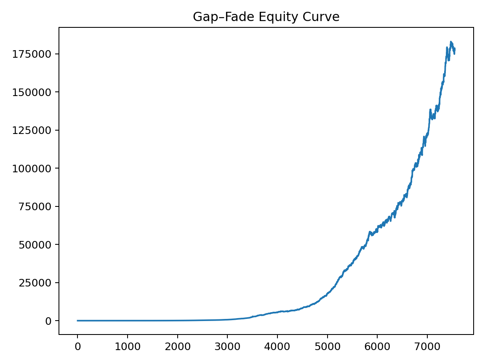

C++ engine for a gap-fade, beta-neutral strategy with helper scripts to fetch S&P 500 data via yfinance.
```bash
g++ -O3 -std=c++17 gap_fade_strategy.cpp -o gap_fade
./gap_fade data/sample/AAPL.csv data/sample/MSFT.csv \
  --benchmark=data/sample/SPY.csv --beta_neutral=1 --beta_lookback=80 \
  --z_min=0.8 --z_max=3.0 --gap_threshold=25 \
  --spread=1 --impact=0.5 --gross=1 --max_weight=0.02 --lookback=20 \
  --top_frac=0.50 --stop_bps=10 --tp_bps=8 \
  --target_vol=0.06 --ewma_lambda=0.97 \
  --dump_equity=out/equity.csv --dump_daily=out/daily.csv
```bash
git init
git add gap_fade_strategy.cpp scripts README.md .gitignore data/README.md
git commit -m "Initial commit: gap-fade engine, scripts, docs"
gh repo create yourname/gapfade --public --source=. --remote=origin --push



